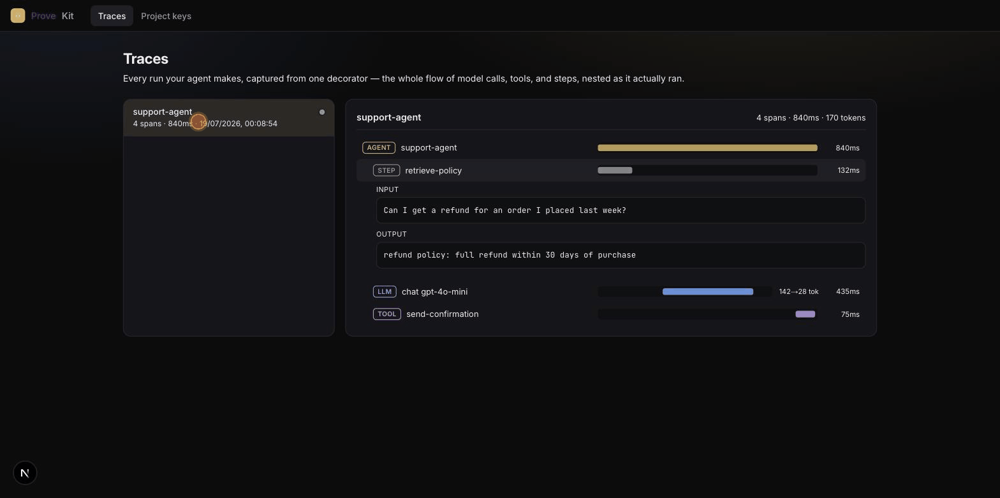

<div align="center">

# ◇ ProveKit

### See exactly what your AI agent did.

**Drop-in tracing, evaluation, and observability for any AI agent.** Add one import and review
every run — the model calls, tools, retries, and failures — as a nested flow. Then evaluate it,
watch it on a dashboard, and gate your CI on it. Open source and self-hostable.

[](https://github.com/MobirizerServices/ProveKit/actions/workflows/ci.yml)
[](LICENSE)

**🌐 Live:** [provekit.online](https://provekit.online) · [Quickstart](#quickstart) · [How it works](#how-it-works) · [Self-hosting](docs/DEPLOY_PROVEKIT_ONLINE.md)



</div>

---

Most tracing tools make you stand up a collector, wire an exporter, or learn their model
before you see a single span. ProveKit's whole thesis is **time-to-first-trace**: create a
project, drop a key in `.env`, `pip install`, add **one import** — and the full nested flow
is in your portal. It's OpenTelemetry underneath (so your data is portable and nothing is
locked in), but you never have to know that.

**More than tracing:** evaluation (build datasets from real traces, score with `pk.evaluate()`,
gate CI on regressions), dashboards + alerts, multi-project with members, and a debug-over-MCP
channel. All open source, all self-hostable.

## Quickstart

**1. Create a project** and copy its key from the portal (Project keys).

**2. Add the SDK — one line:**

```bash
pip install "provekit[trace]"
```

```python
# .env
#   PROVEKIT_API_KEY=pk_...
#   PROVEKIT_ENDPOINT=https://provekit.online   # or your self-hosted URL

import provekit.auto        # one import — captures everything below it

# optional: group a run under a named root
import provekit.trace as pk

@pk.trace(name="support-agent")
def run_agent(question: str) -> str:
    docs = retrieve(question)          # wrap sub-steps with `with pk.span("retrieve"):`
    return llm(question, docs)         # OpenAI / Anthropic calls are captured automatically
```

**3. Run your agent, then open Traces** — every run appears as a nested tree: the entrypoint,
the model calls beneath it, the tools, the steps, each with its input, output, and timing.

## How it works

You decorate the **entrypoint once**. The decorator opens an OpenTelemetry span and makes it
the current context, so everything that runs inside nests underneath it:

- **LLM calls capture themselves.** `pip install "provekit[trace]"` auto-instruments OpenAI
  and Anthropic — no per-call wiring. Any other OTel-instrumented library nests too.
- **Sub-steps, your call.** Wrap a retrieval, a tool, or a branch in `with pk.span("name"):`
  to see it in the tree. Everything else is captured for you.
- **The portal rebuilds the tree** from the span hierarchy and renders it — agent → llm ·
  tool · step — with per-span input/output.

Fail-open by design: if the key/endpoint are unset or the portal is unreachable, your app
runs completely unaffected.

## What it is (and isn't)

ProveKit does **one thing**: capture and review your agent's flow. It's not a prompt-eval
platform or a dataset manager — it's the tracer you reach for when you just want to *see what
your agent did*. Open source (MIT), self-hostable, and OpenTelemetry-native so you're never
locked in.

- **Framework/provider-agnostic** — any Python agent; any OTLP exporter can also POST to
  `/v1/traces` directly (other languages included).
- **Self-hosted** — run it next to your app; see [docs/DEPLOY.md](docs/DEPLOY.md).

## Docs

- [Features](FEATURES.md) — the full inventory of what's built
- [Tracing guide](docs/TRACING.md) — the decorator, `pk.span()`, configuration, what's captured
- [Deployment](docs/DEPLOY.md) — local vs hosted · [Publishing](docs/PUBLISHING.md) — release to PyPI
- [Security](SECURITY.md) · [Contributing](CONTRIBUTING.md)
